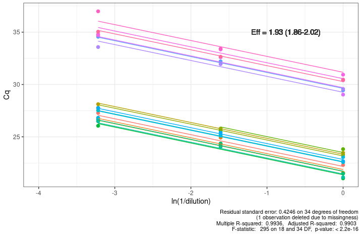
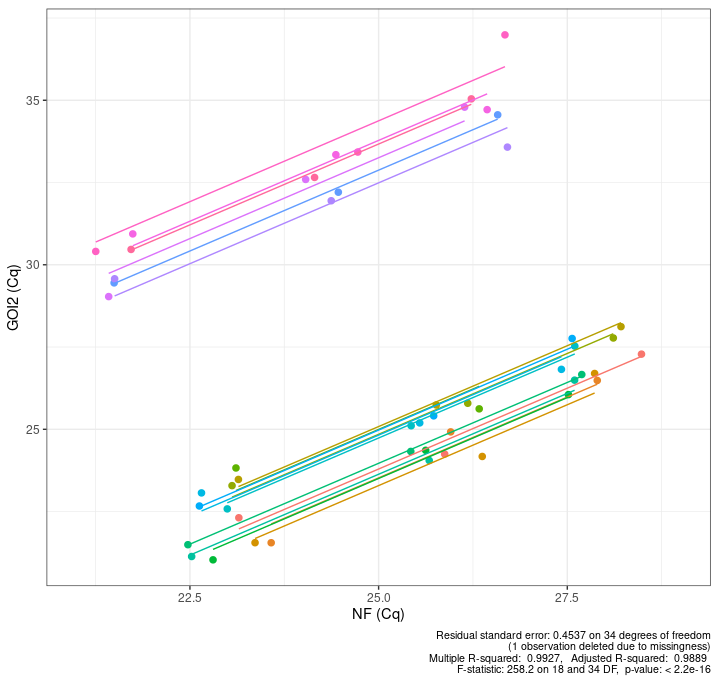
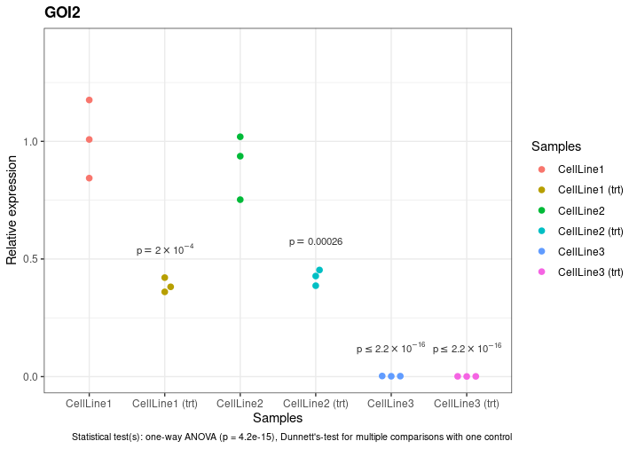
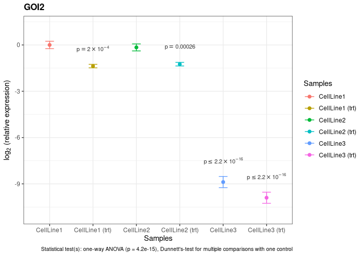
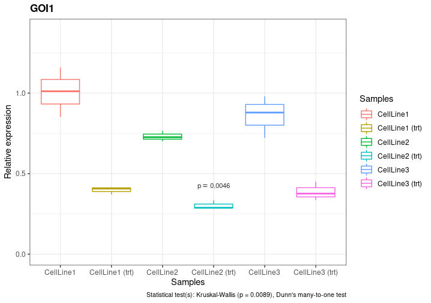
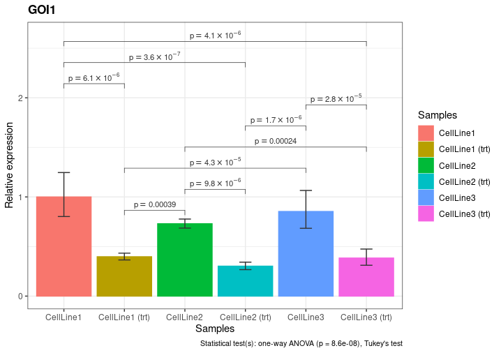
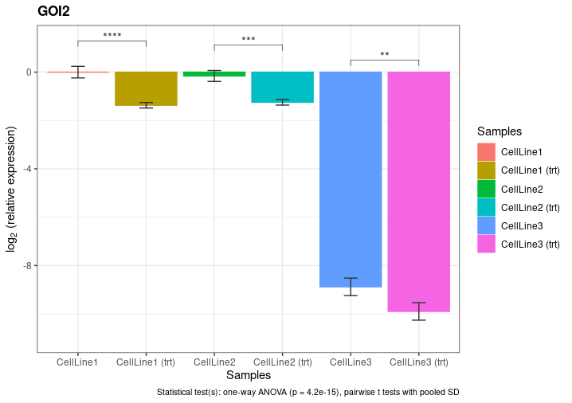

# repDilPCR

<div align="justify">
repDilPCR is a software tool to analyze qPCR data. It has been inspired by the efficient dilution-replicate design for real-time PCR assays by Hui and Feng (Kwokyin Hui & Zhong-Ping Feng. Efficient experimental design and analysis of real-time PCR assays. Channels 2013, 7:3, 160-170, https://doi.org/10.4161/chan.24024) and is the first tool to enable the analysis of experiments performed according to this design. The statistical and the graphical functions of the program can also be used with preprocessed data obtained by more conventional assay designs and evaluation methods.

## Key features
* Ability to use multiple reference genes
* Imputation of missing Cq values (only for reference genes)
* Statistical hypothesis testing with guided selection of appropriate statistical tests
* Preparation of publication-ready plots
* High level of automatization of the whole analysis
* Open-source
* Fast and easy to use
  * single-click analysis of a whole dataset
  * ~1 min from uploading raw Cq values to getting publishable plots
* Multiple customization options
* Possibility to export tabular data at each intermediate step to analyze with third-party programs

## Introduction
In a qPCR experiment, it is of key importance to determine the efficiency of the PCR reaction for each amplicon and primer pair for correct evaluation and interpretation of the data. Different approaches to determine efficiency have been developed, from the classical standard curve-based method to sophisticated methods that rely on fitting linear or non-linear models on individual amplification curves. Occupying the middle ground between these two extremes is the dilution-replicate experimental design of Hui and Feng that has remained somehow overlooked, most probably due to the lack up to now of a dedicated software tool to apply the method. This is a multiple linear regression-based approach with a number of advantages. It requires fewer reactions than the traditional approach with standard curves produced by a separate set of dilutions of a standard sample. In the dilution-replicate design, standard curves are determined from so-called dilution-replicates of experimental reactions that serve both to control technical variance and to determine efficiency. Like this, all samples contribute to the efficiency estimate, thus precision increases with the number of samples on a plate. Furthermore, the traditional approach requires that the linear dynamic range of the independent standard curve covers all sample Cq values which sometimes leads to the necessity to repeat experiments using different dilutions. In contrast, with the dilution-replicate design it is guaranteed that the sample Cq values will be within range.

repDilPCR utilizes the described dilution-replicate analytical method (Kwokyin Hui & Zhong-Ping Feng. Efficient experimental design and analysis of real-time PCR assays. Channels 2013, 7:3, 160-170, https://doi.org/10.4161/chan.24024) and extends it by adding the possibility to use multiple reference genes. It also offers capabilities for performing statistical tests and plotting publication-ready graphs. The program has been designed with the philosophy to automate and speed up analysis of qPCR data (typically less than one minute from raw Cq values to publication-ready plots) and to help users with little knowledge of statistics to select and perform the appropriate statistical tests, at least in the case of one-factor experimental designs. At the same time, the program allows experienced users to export intermediate data and perform more sophisticated analyses with external statistical software, e.g. if two-way ANOVA is necessary.

Although the primary goal of the program is to enable analysis of qPCR data via the dilution-replicate approach, the statistical and plotting functions can also be used with preprocessed data (relative expression values) obtained by usual assay designs and evaluation methods.

## Installation
The program can be installed on a local computer or on a server (see below). Alternatively, users can freely access and use a working installation hosted on a server at the University Hospital in Ulm, Germany (http://not-yet-available). This service is anonymous, does not require registration and complies with common standards for protection of user data: raw data uploaded by the user are processed on the server and used to generate results that can be downloaded by the user; after the user closes the session by closing the browser window all uploaded data and processed results are automatically deleted from the server.

#### Prerequisites for installation
* A working installation of R (version 3.6.0 or more recent) on a computer with a Linux or Windows operating system. (Theoretically MacOS should be possible, too, but I haven't had the chance to test whether it works.) The RStudio integrated development environment is recommended for convenient use of the script but not required.
* The following R packages have to be installed: `car`, `gridExtra`, `tidyverse`, `mice`, `PMCMRplus`, `ggbeeswarm` and `ggsignif` (needed for both the ordinary R script and the Shiny app), as well as `shiny`, `shinycssloaders` and `shinyalert` (needed for the Shiny app only). It's possible that `PMCMRplus` will initially fail to install on a Debian or Ubuntu Linux system. The solution is to first install the GNU Multiple Precision Arithmetic Library (e.g. `gmp-6.2.1.tar.lz`) from https://gmplib.org/, as well as the package `libmpfr-dev` (`sudo apt install libmpfr-dev`).

#### Installation on a local computer
Download the zip archive of all files in the repository by clicking on "Code" and then on "Download ZIP" on the GitHub page of the repDilPCR project or by following this direct download link: https://github.com/deyanyosifov/repDilPCR/archive/refs/heads/main.zip.  (Note: the possibility for download is currently available to invited users only. It will be made available to the general public after publishing the code. For now, if you are interested to get a copy of the program, write to me at deyan.yosifov@uniklinik-ulm.de.) Unzip the archive, this action will create  a new directory named `repDilPCR-main` in the current directory. You can rename the new directory to `repDilPCR` or whatever other name you choose and place it in a convenient place on your computer.  For the purpose of this manual, we will assume that your installation is located in the directory `repDilPCR` in your home folder on a Linux machine, i.e. `~/repDilPCR`. If your situation is different, just replace the `~/repDilPCR` part in the further instructions with the actual path to your installation.

#### Installation on a server
This option is only possible on a server running Linux. Apart from the prerequisites stated above, you will need to install the Shiny Server. (It can be downloaded from https://www.rstudio.com/products/shiny/download-server/, detailed installation instructions are available at https://docs.rstudio.com/shiny-server/#install-shiny.) Installation of repDilPCR on a server is similar to installing on a local computer but the `repDilPCR` directory will have to be placed in `/srv/shiny-server/`. The `shiny` user must have read and write access to `/srv/shiny-server/repDilPCR` and its contents.

## Usage
The program can be used both as an ordinary R script on a local computer or as a Shiny app (either on a local computer or on a server) accessed through a web browser.

### Preparation of the data
This preparatory step is the same no matter whether you intend to use the R script or the Shiny app. Preparing the data will take you some time, especially the first time when you do it, but don't worry, what might seem like wasted time is actually very well invested time because it will bring you considerable time savings later on by enabling automated analysis by repDilPCR.

The input data have to be arranged in a CSV file following a specific format which is different depending on whether one wants to feed into the program raw Cq values obtained from an experiment performed according to the dilution-replicate approach or already calculated relative expression values. Exemplary input data tables for these two use cases are provided in the files `Test_data.csv` and `Test_data_precalc.csv`, respectively, which can be downloaded using the buttons on the `About` tab of the repDilPCR program. Note for international users: a point must be used as the decimal separator and a comma as the field separator (to separate values in each row). Cq values can usually easily be exported by the software controlling your qPCR machine. An important thing that you have to pay attention to is that you select a common threshold for all amplicons in your experiment before exporting the Cq values. Depending on the manufacturer of the machine and the respective software, Cq values might be referred to as Ct ("cycle threshold") or Cp ("crossing point") values but these different names stand for the same thing. Here, we adhere to the MIQE guidelines and the respective terminology (Cq = quantification cycle). If you have never prepared a CSV file before, don't panic. This is easily done in any commonly available spreadsheet software like Microsoft Excel or LibreOffice Calc. You just have to select the CSV file format when saving and to pay attention to the regional settings (point as the decimal separator and comma as the field separator).

**In the case of using raw Cq values,** the CSV file needs to have the following layout. The first row contains column titles. The first three columns have predetermined names that must not be changed. The first column is called "Replicates" and it should contain the names of the samples with a suffix that identifies the biological replicate. The suffix consists of an underscore ("_") plus additional numbers and/or letters. For example, if you have an experimental group called "HeLa" and your experiment contained biological triplicates, they could be entered in the column as "HeLa_1", "HeLa_2" and "HeLa_3". The same convention can be used if your experiment compares groups of patients and each patient provided a single sample. In this case, each subject would be considered a biological replicate of the respective group and assigned an individual suffix number, e.g. if you compared the expression of a gene in 3 groups of 10 subjects each - healthy, leukemia and lymphoma, your labels in the "Replicates" column might be "Healthy_1", "Healthy_2", ..., "Healthy_10", "Leukemia_1", "Leukemia_2", ..., "Lymphoma_1", "Lymphoma_2" and so on (or you could use subject name initials, instead of numbers, as long as they don't occur more than once). If your experiment did not include replicates, the single sample can be entered as either "HeLa_1" or just "HeLa" in the table, it doesn't matter. The underscore character is reserved for the purpose of identifying replicates and should not occur elsewhere in the names of the samples. The second column is called "Pairs" and can contain optional information about grouping of samples in pairs. This is useful if the experiment consists of samples or sample groups that should be compared and statistically evaluated in pairs, e.g. if you have a number of cell lines in each of which you have measured the expression of your gene of interest in two conditions (control and treated) and you are interested in comparing these two conditions for each cell line but don't care about comparisons among cell lines. Then, all replicates from both samples of a given cell line should be assigned the same number in the column "Pairs". For example, all replicates (biological as well as dilution replicates) of "HeLa control" and "HeLa treated" should receive a number 1 in  the "Pairs" column, all replicates of "Jurkat control" and "Jurkat treated" should receive a number 2 and so on. In this way, the program will know which samples constitute a pair. If your experiment does not contain pairs or you do not wish to use this functionality, leave the column empty but do not delete its title. The third column is called "Dilution" and contains the dilution factors according to the dilution-replicate design. For example, if you had 5-fold serial dilutions in your experiment, you can use as factors the numbers 1, 5 and 25 (the actual numbers do not matter, only the ratios among them are important, so you could just as well use 2, 10 and 50). If we return to the example given above, this means that for each biological replicate "HeLa_1", "HeLa_2" and "HeLa_3" you would have three dilution replicates, accordingly each biological replicate should be listed three times in the "Replicates" column and the respective rows in the "Dilution" column should be filled with the numbers 1, 5 and 25 where 1 corresponds to the most concentrated dilution replicate and 25 corresponds to the most diluted one. The following columns should contain the Cq values for the assessed genes, first the reference genes (RG) and then the genes of interest (GOI). The titles of these columns should be the names of the respective genes/amplicons. Here is a quick look at a part of the `Test_data.csv` file as an example of the required format:

```
Replicates,Pairs,Dilution,RG1,RG2,RG3,GOI1,GOI2
CellLine1_1,1,1,22.91,24.69,21.85,23.06,22.31
CellLine1_1,1,5,25.67,27.97,23.99,25.68,24.25
CellLine1_1,1,25,28.08,30.71,26.66,28.42,27.28
CellLine1_2,1,1,23.70,25.33,21.70,23.66,21.55
CellLine1_2,1,5,26.28,27.96,23.63,26.13,24.92
CellLine1_2,1,25,27.74,30.05,25.90,28.02,26.48
CellLine1_3,1,1,23.60,24.67,21.82,23.21,21.55
CellLine1_3,1,5,26.14,28.69,24.29,25.82,24.17
CellLine1_3,1,25,27.42,30.23,25.94,27.64,26.70
..............................................
CellLine1_9,1,1,22.86,24.96,21.44,22.04,21.34
CellLine1_9,1,5,25.45,27.97,23.81,25.49,25.08
CellLine1_9,1,25,27.48,30.03,26.40,28.16,26.29
CellLine1 (trt)_1,1,1,23.27,24.66,21.50,25.15,23.48
CellLine1 (trt)_1,1,5,25.60,27.38,24.32,26.98,25.74
CellLine1 (trt)_1,1,25,28.09,30.45,26.09,28.95,28.12
....................................................
CellLine1 (trt)_9,1,1,22.35,25.30,21.46,24.59,22.49
CellLine1 (trt)_9,1,5,25.58,27.69,24.27,26.67,25.71
CellLine1 (trt)_9,1,25,27.57,29.78,26.16,29.12,27.54
CellLine2_1,2,1,23.41,22.73,22.28,23.43,21.03
CellLine2_1,2,5,25.72,26.29,24.86,26.31,24.36
CellLine2_1,2,25,28.06,27.88,26.61,27.54,26.05
CellLine2_2,2,1,22.99,23.16,21.27,23.16,21.49
.............................................
```

In this example fragment, three experimental groups are present ("CellLine1", "CellLine1 (trt)" and "CellLine2"), the first two of which form a pair (baseline vs. treated), as the same number (1) is present in the second column of all rows occupied by replicates of these two samples ("CellLine2" is part of another pair, as its replicates have the number 2 in the second column.) Each experimental group has 9 biological replicates and each of them has 3 dilution replicates (denoted by the dilution factors 1, 5 and 25 in the third column). Note that we don't call them "technical replicates" as the concentration of the template in them is not identical, nevertheless they simultaneously fulfil two roles: producing standard curves and controlling technical variance. The example fragment above includes three reference genes (labelled "RG1", "RG2" and "RG3") and two genes of interest ("GOI1" and "GOI2"). The order in which you enter your samples in the table is important because this will also be the order in which your samples will be displayed on the graphs, i.e. the sample that the program finds in the first row will become the leftmost sample on the graphs and so on.

**In the case of using relative expression values,** the CSV file that has to be prepared has a simpler layout. Again, the first row contains column titles but now only the first two columns are obligatory and with predetermined names that must not be changed: "Replicates" and "Pairs". Their specification is the same as in the case when raw Cq values are used (see above). The next columns should contain the relative expression levels (linearly scaled) of the evaluated genes of interest in each biological replicate. Accordingly, the titles of these columns would be the respective gene/amplicon names. Here is a quick look at a part of the `Test_data_precalc.csv` file as an example of the required format:

```
Replicates,Pairs,GOI1,GOI2
CellLine1_1,1,1.58,1.42
CellLine1_2,1,1.33,1.70
CellLine1_3,1,1.81,1.98
.......................
CellLine1_9,1,1.91,1.56
CellLine1 (trt)_1,1,0.58,0.60
.............................
CellLine1 (trt)_9,1,0.63,0.78
CellLine2_1,2,1.10,1.72
CellLine2_2,2,1.19,1.27
.......................
```

In this example fragment, three experimental groups are present ("CellLine1", "CellLine1 (trt)" and "CellLine2"), the first two of which form a pair (baseline vs. treated), as the same number (1) is present in the second column of all rows occupied by replicates of these two samples ("CellLine2" is part of another pair, as its replicates have the number 2 in the second column.) Each experimental group has 9 biological replicates. The example fragment above includes two genes of interest ("GOI1" and "GOI2"). The order in which you enter your samples in the table is important because this will also be the order in which your samples will be displayed on the graphs, i.e. the sample that the program finds in the first row will become the leftmost sample on the graphs and so on.

### Usage of the Shiny app
The Shiny app can be used via any modern web browser. Users have two options:
* access a publicly available Shiny server with repDilPCR installed on it, for example the installation hosted at the University Hospital of Ulm (http://not-yet-available)
* if repDilPCR is installed on their local computer (see above for how-to), they can start the R environment and issue the following commands:
  ```
  library(shiny)
  runApp("~/repDilPCR/app.R", launch.browser = TRUE)
  ```
  replacing the `~/repDilPCR` part with the actual path to their installation, if deviating. This should launch the program and automatically start a new browser    window or tab to access it.
  
#### 1. Upload your data
This is straightforward: just click the `Browse` button, select your already prepared CSV file and upload it. At this point, if your file was formatted correctly, your data should appear in the pane to the right of the app control panel. The program will automatically know whether your data contain Cq values or already calculated relative expression levels. If the browser window grays out, this means that an error has occurred, most probably because your file was not formatted correctly. You will have to refresh the page and upload a corrected version of your CSV file that adheres to the specifications stated above.

#### 2. Select your reference genes and (optionally) impute missing Cq values
*(This whole step is only relevant when working with raw Cq values.)*

This is very easy because you have already arranged the columns with the Cq values of your reference genes in the place where the program expects them to be: between the column "Dilution" and the columns with the Cq values of your genes of interest. The only thing that the program does not yet know is how many of them there are. You provide this information by entering the correct number under `Number of reference genes` in the app control panel.

In principle, if you have multiple reference genes in your experiment (strongly recommended, see this classic work: https://doi.org/10.1186/gb-2002-3-7-research0034), the Cq values from the separate reference genes are averaged to calculate the normalization factor for each biological replicate. With the dilution-replicate design this averaging has to be performed at each dilution level. As it happens every now and then, a single or several reactions on your PCR plate may fail (pipetting errors, contamination with inhibiting substances, bad arrangement of the planets, you name it). Consequently, if one of the dilution replicates for one of the reference genes fails, the normalization factor for this dilution level of the affected biological replicate would not be able to be calculated although the respective dilution replicates for the other reference genes are perfectly fine. Furthermore, Cq values for the genes of interest would not be able to be plotted against missing normalization factor data points when constructing the Cq-Cq plots. This would be an annoying situation because it would lead to a bigger loss of information than actually inflicted by the failure of the single reaction. However, one can take advantage of the facts that (1) correlation should exist between the Cq values of the reference genes, (2) normally there would be other biological replicates with intact sets of dilution replicates across all reference genes and (3) Cq values depend on the dilution level. This information allows one to construct a model and perform imputation of the missing values and thus to minimize the uncertainty in determining the normalization factors. This is easily done in repDilPCR by selecting the respective option in the app control panel. This capability has to be used judiciously: although it works very reliably in the majority of cases, the power of imputation will come to a limit if your experiment has too many missing values or no biological replicates.

<sub>Technical note: imputation in repDilPCR is performed using the R package `mice` with the options `method = 'midastouch', m = 20, maxit = 20`, i.e. the imputation method that is used is weighted predictive mean matching and 20 multiple imputations are performed, each of them with 20 iterations. The mean of the 20 imputed values is taken as the final result and passed further on. In principle, `mice` depends on a random number generator to perform its calculationsuses which can lead to slightly different results when the same data is analyzed multiple times. In order to make repDilPCR return reproducible results when the same dataset is analyzed multiple times, the random number generator state is kept constant by using a hard-coded seed `set.seed(40075017)`.</sub> 

You can see the full preprocessed dataset (original and imputed values together in a single table) by clicking on the tab "Preprocessed input data" in the right pane of the program window (*this tab is only visible when working with raw Cq values*). This preprocessed table will contain two additional columns titled "Samples" and "NF", where "NF" is a virtual reference gene whose Cq values are obtained by averaging the Cq values of the real reference genes. If you want, you can download this table by going to `Download results / Intermediate data` and clicking on the `Download table with imputed Cq values (if any)` button.

#### 3. Analyze your data
Simply click on the big green `Analyze` button in the app control panel. All optional parameters below the button can be adjusted afterwards, too. The results will appear in the respective tabs of the right pane of the program window **after** you click on them.

#### 4. Check the results of the regression analysis
*(This step is only relevant when working with raw Cq values.)*

It is good practice to inspect the standard curves and Cq-Cq plots before proceeding further to make sure that there are no outliers and that the coefficients of determination (R<sup>2</sup>) are large enough (close to 1). Go to the `Regression plot` tab (*only visible when working with raw Cq values*) and two subtabs will appear: `Standard curves` and `Cq-Cq plots`. Note that depending on the number of your samples it may take some time (seconds) from the moment you click on one of them till the graphs are rendered and displayed.

The standard curve plots will be listed one under the other in the following order: first the genes of interest, then the virtual reference gene ("NF") produced by averaging the Cq values of the real reference genes and then the real reference genes themselves. Each plot will consist of as many standard curves as there are samples (biological replicates) and all of them will be parallel to each other (because we have performed multiple linear regression with parallel slopes). Different colour will be assigned to each sample (biological replicate) to help you identify them on the plots. Statistical summary will be displayed under the legend of each plot and will include residual standard error with degrees of freedom, number of missing observations (if any), coefficients of determination (R<sup>2</sup> and adjusted R<sup>2</sup>), F-statistic with degrees of freedom and p-value of the regression. The PCR efficiency ("Eff") for each amplicon will be displayed in the respective plot together with its 95%-confidence interval. This is what a typical standard curves plot looks like:



Efficiences can be downloaded as a table by navigating to `Download results / Intermediate data` and clicking on the `Download table with calculated efficiences` button. All standard curve plots can be downloaded as a PDF file or as a ZIP archive of PNG files by clicking on the respective download button. The file format can be changed by selecting the respective option at the bottom of the app control panel. In the case of the PNG format, one can also select the desired width, height and resolution.

The `Cq-Cq plots` subtab will include Cq-Cq plots for each gene of interest against the virtual reference gene. Again, each plot will consist of as many parallel regression lines as there are samples (biological replicates) and will have a statistical summary underneath, as for the standard curves plots. Similarly, Cq-Cq plots can be downloaded as a file from the `Download results / Intermediate data` subtab. This is what a typical Cq-Cq plot looks like:



#### 5. Look at the results
The `Results` tab has two subtabs: `Plots in linear scale` and `Plots in logarithmic scale`. Each of them will have its own subtabs, that will display your results as different types of graphs. The exact types of plots that are available will depend on the type of statistical tests that you have chosen on the left: parametric or non-parametric. If "parametric" is selected, the available choices will be: `Dot plots (all points)`, `Dot plots (means and standard deviations)` and `Bar graphs (means and standard deviations)`. If "non-parametric" is selected, the available choices will be `Dot plots (all points)` and `Box plots`. The control panel on the left gives you the opportunity to change the visual appearance of the plots, as well as to control parameters of the statistical tests. Labelling of samples and genes will happen automatically based on the information in the uploaded data table and will not require additional effort from you.

##### 5.1. Perform statistical tests
repDilPCR aims to make the process of testing statistical hypotheses easy even for users without much knowledge of statistics by automatically selecting appropriate statistical tests depending on the context and properties of the data. (If you don't want to perform statistical tests, remove the tick from the checkbox `Test for statistically significant differences between samples or experimental groups` in the control panel). The user can choose the broad type of statistical test (`parametric` or `non-parametric`) and the comparisons to be tested for statistically significant differences (`all to one (all to reference)`, `all pairs` and `selected pairs`) by clicking on the respective radio buttons in the control panel. The significance level (&alpha;) can also be freely selected. To make usage of parametric tests possible, all statistical tests are performed on logarithmically transformed data, even when the user chooses to display plots in linear scale (qPCR data are not normally distributed on a linear scale!).

When the option `all to one (all to reference)` is selected, one of the experimental groups (by default the first one in the data table, resp. the leftmost on the plot) will be compared against all other experimental groups. Any other experimental group can be made the reference by entering its name in the text box under the option `Reference sample or experimental group` in the control panel and pressing the `Analyze` button again. Experimental groups in which the expression of a given gene of interest is significantly different from that in the reference group will be marked as such with asterisks or with p-values based on the user's choice. The statistical test that was automatically chosen and performed in each particular case will be listed below the respective plot. Read the technical notes below for more details on the logic that selects the statistical test.

When the option `all pairs` is selected, each of the experimental groups will be compared against any other experimental group. Comparisons for which the expression of a given gene of interest is significantly different between the groups will be marked by significance bars with either p-values or asterisks on top of them depending on the user's choice. The statistical test that was automatically chosen and performed in each particular case will be listed below the respective plot. Read the technical notes below for more details on the logic that selects the statistical test.

When the option `selected pairs` is selected, experimental groups will be compared in pairs according to the pairing information provided in column "Pairs" of the data table (see Preparation of the data). Comparisons for which the expression of a given gene of interest is significantly different between the groups constituting a pair will be marked by significance bars with either p-values or asterisks on top of them depending on the user's choice. The statistical test that was automatically chosen and performed in each particular case will be listed below the respective plot. Read the technical notes below for more details on the logic that selects the statistical test.

These are some exemplary plots using the test data above:

*Dot plot (all points) in linear scale, all groups compared to a referent one:*



*Dot plot (means and confidence intervals) in logarithmic scale, all groups compared to a referent one:*



*Box plot in linear scale, all groups compared to a referent one via non-parametric tests:*



*Bar graph in linear scale, all groups compared to one another:*



*Bar graph in logarithmic scale, groups within selected pairs compared to one another:*



<sub>Technical notes:</sub>
<sub>When the options `all to one (all to reference)` and `parametric` are selected, repDilPCR will first evaluate the number of experimental groups and whether variance is homogenous among them by using Levene's test (the function `leveneTest` from the package `car`). If there are only two groups, an unpaired two-sided t-test will be performed. If Levene's test was not significant (p > 0.05), the variances of the two groups will be treated as equal and the pooled variance will be used by the t-test. If Levene's test was significant (p <= 0.05), Welch's approximation will be used. If there are more than two groups, ANOVA (analysis of variance) will be performed using the function `aov` if Levene's test was not significant or Welch's ANOVA using the function `oneway.test` will be performed in case Levene's test was significant (both ANOVA functions are from the package `stats`). If the p-value of the ANOVA test is lower than or equal to the chosen significance level (&alpha;, 0.05 by default), repDilPCR will perform a post-hoc test: Dunnett's multiple comparisons test with one control (if Levene's test was not significant) or Tamhane-Dunnett's multiple comparisons test with one control (if Levene's test was significant). The last two tests are performed by the functions `dunnettTest` and `tamhaneDunnettTest` from the package `PMCMRplus`, respectively. Post-hoc tests automatically take care of the multiple testing problem, so reported p-values don't need adjustment when considered at the level of a single plot (single gene of interest). If you have evaluated many genes of interest, you might need additional correction for multiple testing depending on your research question.</sub>

<sub>When the options `all to one (all to reference)` and `non-parametric` are selected, repDilPCR will first evaluate the number of experimental groups. If there are only two groups, an unpaired two-sided Wilcoxon test (also known as Mann-Whitney test) will be performed using the function `wilcox.test` from the package `stats`. If there are more than two groups, a Kruskal-Wallis rank sum test will be performed using the function `kruskalTest` from the package `PMCMRplus`. If the p-value of the Kruskal-Wallis test is lower than or equal to the chosen significance level (&alpha;, 0.05 by default), repDilPCR will perform Dunn's non-parametric many-to-one comparison test as a post-hoc test using the function `kwManyOneDunnTest` from the package `PMCMRplus`. Post-hoc tests automatically take care of the multiple testing problem, so reported p-values don't need adjustment when considered at the level of a single plot (single gene of interest). If you have evaluated many genes of interest, you might need additional correction for multiple testing depending on your research question.</sub>

<sub>When the options `all pairs` and `parametric` are selected, repDilPCR will first evaluate whether variance among experimental groups is homogenous by using Levene's test (the function `leveneTest` from the package `car`) and perform ANOVA using the function `aov` if Levene's test was not significant or Welch's ANOVA using the function `oneway.test` will be performed in case Levene's test was significant (both ANOVA functions are from the package `stats`). If the p-value of the ANOVA test is lower than or equal to the chosen significance level (&alpha;, 0.05 by default), repDilPCR will perform a post-hoc test: Tukey's all-pairs comparison test if Levene's test was not significant or an alternative test if Levene's test was significant. The alternative test will be Dunnett's T3 all-pairs comparison test for smaller sample sizes  (<50 per group) or Games-Howell all-pairs comparison test for larger sample sizes. The post-hoc tests are respectively performed by the functions `tukeyTest`, `dunnettT3Test` and `gamesHowellTest` from the package `PMCMRplus`. Post-hoc tests automatically take care of the multiple testing problem, so reported p-values don't need adjustment when considered at the level of a single plot (single gene of interest). If you have evaluated many genes of interest, you might need additional correction for multiple testing depending on your research question.</sub>

<sub>When the options `all pairs` and `non-parametric` are selected, repDilPCR will first perform the Kruskal-Wallis rank sum test using the function `kruskalTest` from the package `PMCMRplus`. If the p-value of the Kruskal-Wallis test is lower than or equal to the chosen significance level (&alpha;, 0.05 by default), repDilPCR will perform Dunn's non-parametric all-pairs comparison test as a post-hoc test using the function `kwAllPairsDunnTest` from the package `PMCMRplus`. Post-hoc tests automatically take care of the multiple testing problem, so reported p-values don't need adjustment when considered at the level of a single plot (single gene of interest). If you have evaluated many genes of interest, you might need additional correction for multiple testing depending on your research question.</sub>

<sub>When the options `selected pairs` and `parametric` are selected, repDilPCR will first evaluate whether variance among experimental groups is homogenous by using Levene's test (the function `leveneTest` from the package `car`) and then perform unpaired two-sided pairwise t-tests using the function `pairwise.t.test` from the package `stats`). The pairwise t-tests will be performed with pooled variance in case Levene's test was not significant. Reported p-values from the pairwise t-tests will be adjusted for multiple testing using the Bonferroni correction at the level of each gene of interest (each single plot). If you have evaluated many genes of interest, you might need additional correction for multiple testing depending on your research question.</sub>

<sub>When the options `selected pairs` and `non-parametric` are selected, repDilPCR will conduct unpaired pairwise Wilcoxon rank sum tests using the function `pairwise.wilcox.test` from the package `stats`. Reported p-values from the pairwise Wilcoxon rank sum tests will be adjusted for multiple testing using the Bonferroni correction at the level of each gene of interest (each single plot). If you have evaluated many genes of interest, you might need additional correction for multiple testing depending on your research question.</sub>

<sub>The functions `dunnettTest`, `tamhaneDunnettTest`, `kwManyOneDunnTest` and `tukeyTest` depend on a random number generator to perform their calculations which can lead to slightly different results when the same data is analyzed multiple times. In order to make repDilPCR return reproducible results when the same dataset is analyzed multiple times, the random number generator state is kept constant by using a hard-coded seed `set.seed(40075017)`.</sub>

##### 5.2. Adjust the visual appearance of the plots to your needs
Users can adjust the font size on plots by using the respective input box `Font size on text plots` in the control panel. Changing the preset number (9) will scale proportionately all different font sizes that occur on plots.

Statistical significance can be denoted on plots with either numeric p-values or asterisks. The choice can be stated by selecting the respective radio button under `Display format of statistical significance on plots`. In the case of asterisks, their number corresponds to the significance level according to the following convention: * denotes 0.01 < p &le; 0.05, ** denotes 0.001 < p &le; 0.01, *** denotes 0.0001 < p &le; 0.001, **** denotes p &le; 0.0001.

In the case of statistical tests comparing all possible pairs of experimental groups, the resulting plots might become overcrowded with significance bars. repDilPCR strives to distribute them in a way that they don't overlap each other and its algorithm works well in most cases. However, if there are a lot of experimental groups and a lot of the comparisons are significantly different, the automatic algorithm may fail to prevent overlapping of significance bars. Users can influence the algorithm by changing the spacing factor under `Distance between significance bars on plots`. Its default value is 1.5. Increasing this heuristic parameter will increase the distance between significance bars. Conversely, if the distances between significance bars are too big and they are wasting space on plots, you can try decreasing the spacing factor.

#### 6. Download results
All plots and tables that repDilPCR produces can be downloaded from the `Download results` tab. It has three subtabs: `Plots`, `Tables` and `Intermediate data`.

The `Plots` subtab contains download buttons for plots of final results. They are organized into two subtabs: `Plots in linear scale` and `Plots in logarithmic scale`. Each of them will contain download buttons for different types of graphs: dot plots (all points), dot plots (means and confidence intervals), bar graphs and box plots. The exact types that will be available depend on the choice of statistical tests from the control panel (see 5.1.). All plots can be downloaded in the PDF or PNG file format. The available formats can be chosen by clicking on the respective radio button under `Format of graphical output (only for downloadable files)` in the control panel. PDF files will be multi-page, meaning that the plots for all genes of interest will be put together in a single file on separate pages. Each PNG file will contain a single plot (gene) but all plots of a particular type will be grouped together and downloaded as a ZIP archive. In all cases, downloaded files will have automatically created informative file names that will include the name of the dataset (uploaded data file) and the plot type. Additionally, plots in logarithmic scale will have "log" in their file names. Plots in PDF files are stored as vector graphics and they are scalable without loss of resolution. PNG files use raster graphics and their resolution depends on the size of the image and the number of pixels. Users can specify these parameters in the control panel to get a PNG file that will conform to their requirements (or the requirements of a journal in which they intend to publish).

The `Tables` subtab enables downloading of the final results as tables in CSV format. Four choices are possible: "relative expression values for each replicate (linear scale)",  "relative expression values for each replicate (logarithmic scale)", "mean expression values (linear scale)" and "mean expression values (logarithmic scale)".

The `Intermediate data` subtab enables downloading of tables and plots created during the intermediate steps of the analysis: table of preprocessed input data including imputed Cq values (if any), table of calculated efficiencies for the different amplicons, plots of standard curves and Cq-Cq plots. The tables are in CSV format and the plots can be downloaded in PDF or PNG format depending on the selected settings (see above).

### Usage of the R script
The R script (repDilPCR.R) is an alternative of the Shiny app and offers the same functions but might be preferred by users with experience in R. It offers the advantage of even faster processing of data as the user just has to specify the path to the data, set the preferences for the analysis and then execute the script. Then all intermediate and final results will be automatically saved in the same directory as the raw data without the need to click around in a graphical interface and to download result files one by one.

The executable script is called repDilPCR.R and is located in the directory where repDilPCR has been installed. It depends on repDilPCR_lib.R which contains the actual functions and has to be in the same directory as repDilPCR.R. Before executing, the user should open repDilPCR.R in a text editor or more conveniently in RStudio and modify the variables as needed for the particular analysis. All user-modifiable variables can be found in the beginning of the file (lines 10-27) right after the header with the basic information about the script and are separated into two parts: mandatory variables and optional variables. All variables are the same as those found in the graphical interface of the Shiny app (see the previous section for more detailed explanation of their meaning and usage).

The mandatory variables include the path to the dataset that is to be processed and the number of reference genes that it contains. They are called `input.table` and `RG`, respectively. The script won't run or will run erroneously if you forget to set these variables to reflect the actual situation with your data.
* `input.table` - enter the full path to the input CSV file between the quotation marks.
* `RG` - corresponds to `Number of reference genes` in the graphical interface (see point 2. in "Usage of the Shiny app"). Default value: `3`. Change it as needed.

The optional variables are:
* `impute` - corresponds to `Impute missing Cq values of reference genes` in the graphical interface (see point 2. in "Usage of the Shiny app"). Set to `TRUE` (default) or `FALSE` to respectively enable or disable imputation of missing Cq values of reference genes. Do not set to `TRUE` if your experiment does not contain replicates.
* `ref.sample` - corresponds to `Reference sample or experimental group` in the graphical interface. It specifies the reference sample in which gene expression will be regarded as 1 (100%) on linear scale and 0 on log2-scale, respectively. If set to `"default"` (default), this will be the first sample in the table, resp. the leftmost sample on the plots. Change to the name of another sample (without a trailing underscore and replicate number) to make it the reference sample. If the variable is set to the empty string `""`, results will be shown in their original form, without forcing any particular sample to be 1 (100%) or 0.
* `statistics` - corresponds to `Test for statistically significant differences between samples or experimental groups` in the graphical interface. Set to `TRUE` (default) or `FALSE` to respectively enable or disable tests for statistical significance between samples or experimental groups.
* `test.type` - corresponds to `Type of statistical test(s)` in the graphical interface (see point 5.1. in "Usage of the Shiny app"). Possible values: `"parametric"` (default) and `"non-parametric"`.
* `posthoc` - corresponds to `Comparisons to test for statistically significant differences` in the graphical interface (see point 5.1. in "Usage of the Shiny app"). It specifies the comparisons to be tested for statistically significant differences. Possible values: `"all to one"` (default), `"all pairs"` and `"selected pairs"`.
* `alpha` - corresponds to `Significance level (&alpha;)` in the graphical interface (see point 5.1. in "Usage of the Shiny app"). Default value: `0.05`.
* `font.size` - corresponds to `Font size of text on plots` in the graphical interface (see point 5.2. in "Usage of the Shiny app"). Default value: `9`.
* `sign.repr` - corresponds to `Display format of statistical significance on plots` in the graphical interface (see point 5.2. in "Usage of the Shiny app"). Possible values: `"values"` (default) and `"asterisks"`.
* `sp.f` - corresponds to `Distance between significance bars on plots` in the graphical interface (see point 5.2. in "Usage of the Shiny app"). Default value: `1.5`.
* `plot.format` - corresponds to `Format of graphical output (only for downloadable files)` in the graphical interface (see point 6. in "Usage of the Shiny app"). Possible values are `"PDF"` (default), `"PNG"`, `"both"` and `"none"`.
* `png.size` - corresponds to width and height in `Settings for PNG plots` in the graphical interface (see point 6. in "Usage of the Shiny app"). The default value is `"c(190,134)"` (interpreted as 190 mm width and 134 mm height) and fits well to the A5 page size format in landscape orientation.
* `png.dpi` - corresponds to `Resolution in dpi` in the graphical interface (see point 6. in "Usage of the Shiny app"). The default value is `96`.

After changing the variables as necessary, save the modified file and start the script. There are different ways to do this.
* You can navigate in the terminal to the directory where repDilPCR has been installed and then issue the command `Rscript repDilPCR.R`
* If you have the file repDilPCR.R open in RStudio, all you have to do is to select all text (`Ctrl+A`) and then click on `Run`.
* You can start R in a terminal and then enter the command `source("~/repDilPCR/repDilPCR.R")` (if repDilPCR is installed in a different directory on your computer, you will have to modify the path accordingly).

It will take from a few seconds up to a minute for the script to execute depending on the speed of your computer, the size of the dataset, the selected parameters of the analysis and eventually the presence of missing Cq values of the reference genes. All results will be delivered in the directory containing the input dataset as long as the variable `input.table` has been set corrrectly.

## Frequently asked questions

*Is repDilPCR only usable with raw Cq data obtained from experiments according to the dilution-replicate design?*

No, you can also feed precalculated relative quantities into the program. Of course, in this case you will only be able to use the statistical and graphical functions of repDilPCR.

*repDilPCR seems nice and I would like to try it but I have doubts about the dilution-replicate method. Does it give comparable results to the traditional methods?*

In our lab, we have directly compared the dilution-replicate approach with two of the most widely used traditional methods, the standard curve method and LinRegPCR (Ruijter et al., Amplification efficiency: linking baseline and bias in the analysis of quantitative PCR data. Nucleic Acids Research 2009, 37:6, e45, https://doi.org/10.1093/nar/gkp045), using the same samples. Generally, the three methods yielded very similar results but the standard curve method and repDilPCR outperformed LinRegPCR in an assay for miRNAs as the amplification curves in this assay had lower plateau and shorter exponential part which was not sufficient for LinRegPCR to reliably determine the so called window of linearity that this method relies upon for calculating reaction efficiences.

*Do I need technical replicates with the dilution-replicate method?*

The dilution-replicate method is based on so called dilution replicates. They serve both as a means to produce standard curves and to control technical variance. However, they are not called "technical replicates" as the concentration of the template in them is not identical. An estimation for the technical repeatability in an assay can be obtained from the standard curves plot and the goodness of fit (R<sup>2</sup> and adjusted R<sup>2</sup>). High values of adjusted R<sup>2</sup> (close to 1) speak for low technical variance in the assay as a whole. Single samples with high technical variance can be identified on the plot as one or more of their data points would lie away from the respective  regression lines. Such samples should be regarded with caution and excluded from the analysis if they deviate too much.

*Are standard curves with only 3 dilution points reliable enough to estimate the efficiency of the reaction?*

Although each individual standard curve would be based on only 3 dilutions, the multiple linear regression with parallel slopes would be based on the dilution points of all samples. As the slope is constrained, it effectively acts like an extra point in each sample. The degrees of freedom for the fit are given by the formula [(dilution points − 1) × (number of samples) − 1]. Thus, the more the samples, the better the precision. See the original publication of the method for more information (Kwokyin Hui & Zhong-Ping Feng. Efficient experimental design and analysis of real-time PCR assays. Channels 2013, 7:3, 160-170, https://doi.org/10.4161/chan.24024).

*Do the error bars on plots reflect technical variance, biological variance or both?*

Technical variance in a qPCR experiment is usually much smaller than variance between biological replicates and repDilPCR simply ignores it when calculating the variance in samples or experimental groups. You will see error bars only if you had biological replicates in your experiment (see "Preparation of the data" for information on how to name biological replicates so that the program will recognize them as such). You can get an impression of the technical variance by looking at the standard curves plots and the statistics below them (see the previous question). If you are specifically interested in determining technical variance with the method, you should perform replicates of the whole dilution series for each sample, which replicates you can name according to the convention for biological replicates (see "Preparation of the data").

*What do the error bars show? I see they are sometimes not symmetric, is this an error?*

For plots in logarithmic scale, the error bars denote the standard deviations and are symmetric. For plots in linear scale, the error bars show the 1-&alpha; confidence intervals (the default value of &alpha; is 0.05, so by default you will get 95%-confidence intervals). Confidence intervals are calculated from standard deviations in logarithmic scale and then converted to the linear scale. It is perfectly normal if they look asymmetric around the mean value.

*Why so complicated? Can't error bars depict standard deviation also on plots in linear scale?*

qPCR data are not normally distributed in linear scale. In this case, showing confidence intervals is more informative.

*If data are not normally distributed in linear scale, then why does repDilPCR use parametric statistical tests that assume normal distribution of the data?*

All statistical tests in repDilPCR are performed on log-transformed data, even when for display purposes you choose to prepare a plot in linear scale.

*Can repDilPCR perform two-way ANOVA?*

No. A leading concept in the design of the program was to make it simple (but sound) and offering high level of automation. Experiments with higher number of explanatory variables are too versatile and writing an algorithm that would be able to select an appropriate statistical test in each possible case would be too complicated. However, this should not stop you from using the dilution-replicate design and repDilPCR for the initial processing of the data as  repDilPCR allows downloading of all intermediate and final results in the open and widely compatible CSV format, so further processing with specialized statistical programs or popular spreadsheet software will not be a problem.

*Significance bars on my plots overlap and p-values are unreadable. What can I do?*

If there are a lot of experimental groups and a lot of the comparisons are significantly different, repDilPCR's algorithm may fail to prevent overlapping of significance bars. You can influence the algorithm by changing the spacing factor under `Distance between significance bars on plots` in the Shiny app (the equivalent variable in the R script is called `sp.f`). Increasing it will increase the distance between significance bars. Conversely, if the distances between significance bars are too large and they are wasting space on plots, you can try decreasing the spacing factor.

*Where does the name repDilPCR come from?*

Of course, the name and the logo of the program are allusion to the fact that developing the program was sponsored by the reptilians with the aim to subject mankind by enabling wider usage of the qPCR method, which has already been used by them to spread belief in the existence of a pandemic caused by the non-existing virus SARS-CoV-2. More sinister things are about to come. Watch out and wear your tin hat!